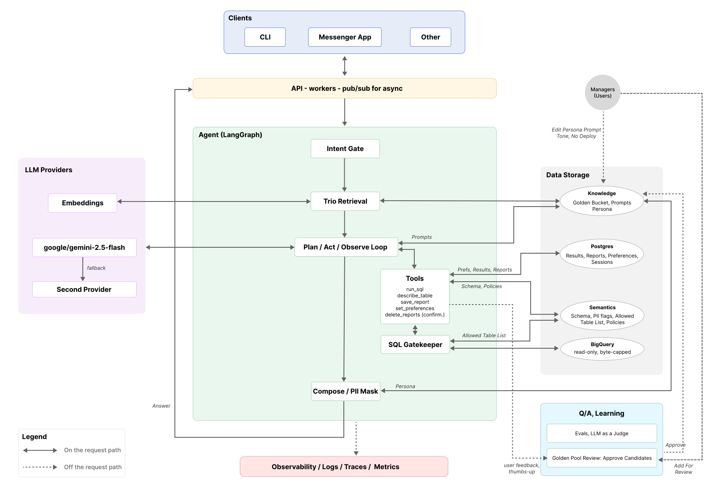
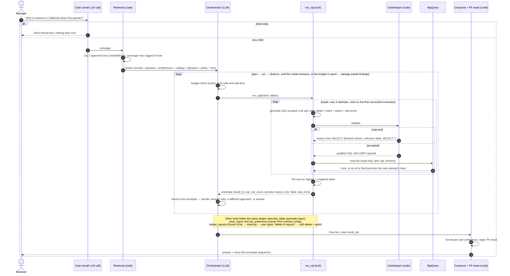

# Retail Analysis Agent — High-Level Design

This is the production design. The repo holds a prototype of the same architecture with
local stand-ins for the managed parts (SQLite instead of Postgres, files instead of GCS,
a CLI instead of an API). The last section maps one to the other.

The LLM plans and writes SQL. Deterministic code decides what SQL may run, who owns what, what
counts as consent, and what text may leave the system. If the model misbehaves, the
worst case is a wrong analysis, never a leaked email or a deleted report nobody confirmed.

## 1. System overview

Solid arrows are synchronous and part of producing the answer; two heads mean request and
response. Dashed arrows are off the request path: async delivery, failover, feedback,
offline jobs, telemetry.

**Clients.** Anything that can talk HTTP. The CLI is a thin client of the same API as
Slack; nobody holds warehouse credentials on a laptop.

**API and workers.** One HTTP API in front of one graph. Interactive clients get the answer
streamed back on the open connection. Slack and scheduled reports cannot wait, so the API
acknowledges, drops a job on Pub/Sub, a worker runs the same graph, and the answer is posted
back to the channel through the Slack API. Cloud Run for both, the worker as a job pulling
from the queue.

**Agent.** One LangGraph graph. A gate classifies the message before anything else runs.
Retrieval pulls relevant analyst trios and always runs before planning. The loop plans a
step, calls a tool, reads the result envelope, and re-plans until it can answer or its
budget is spent. Every SQL the model writes passes the gatekeeper before it reaches
BigQuery. The composer applies persona and user preferences, masks PII in the final text,
and the answer goes back to the API. Section 2 zooms in.

**LLM providers.** Gemini 2.5 Flash on Vertex AI for the orchestrator, the gate and SQL
generation; a second vendor as fallback behind a circuit breaker; a Vertex embedding model
for retrieval. Vertex keeps auth on IAM and data in-region. The fallback exists for outages,
not for quality.

**Data.** Four stores, grouped by what they hold rather than what they run on.

- *Knowledge*: the golden bucket (trio files in GCS with a vector index built from them)
  and the persona and prompt config. Admins and analysts edit these directly; a persona
  change is live on the next request, no deploy.
- *Postgres*: everything the app writes. Graph checkpoints per session, query result
  snapshots, saved reports, user preferences, audit log.
- *Semantic layer*: the hand-curated description of the warehouse. Tables, columns, types,
  PII flags, the column allowlist, join paths, business glossary, query policy. Read by the
  gatekeeper (allowlist), by the tools (`describe_table`, the SQL generation prompt) and by
  the planner (catalog). This is the primary PII defense: blocked columns do not exist as
  far as the model is concerned.
- *BigQuery*: the warehouse. Read-only service account, `maximum_bytes_billed` and a
  timeout on every job.

**Observability.** Structured logs from every node and tool, LLM traces per request,
metrics and alerts on top. Section 5, R7.

**Quality and learning.** Nothing here is on the request path. The eval job runs the
approved trios through the API and grades the answers with a judge model, in CI and on a
schedule. The review step is how the golden bucket grows: a user's thumbs-up on a good
answer creates a candidate, an analyst approves it, the index is rebuilt. Two human gates,
so the bucket cannot poison itself.

## 2. One request through the agent

Points worth calling out:

- **Everything with a decision that matters is code.** The gate's verdict is the model's,
  but "anything except an explicit ALLOW is a refusal" is code. Which columns exist, which
  SQL runs, who owns a report, what counts as a confirmation: code.
- **Two kinds of LLM calls.** The orchestrator call carries the conversation and the
  persona. The SQL generation call inside `run_sql` carries only the schema of the named
  tables, the glossary, the policy, the intent and the last error. Small prompts are
  cheaper, more accurate and easier to test.
- **The envelope is the contract.** The model never sees a DataFrame. It sees the result
  id, the final SQL, the row count and a preview. Full rows go to the registry and to a
  snapshot table, because a saved report has to keep the numbers it was written from.
- **Failures return, they do not raise.** A tool that gives up returns `ok: false` with
  the reason so the orchestrator can change approach or answer with what it has. The
  budget check turns "out of budget" into a final answer that states what is missing
  rather than an error.

## 3. Services and tools

| Concern | Choice | Why |
|---|---|---|
| Compute | Cloud Run: a service for the API, a job for the worker | Stateless, scales to zero, same project and IAM as BigQuery |
| Async work | Pub/Sub + Cloud Scheduler | Slack replies and scheduled reports without holding connections open |
| Orchestration | LangGraph | The repair loop is a cycle and the delete confirmation is an interrupt; both are native graph features. The checkpointer makes sessions resumable |
| LLM glue | LangChain core | Tool binding, message types, provider adapters, nothing more |
| Primary model | Gemini 2.5 Flash on Vertex AI | Cheap, fast, good tool calling, large context; IAM auth, regional data |
| Fallback model | A second vendor via OpenRouter or Bedrock | Independent failure domain; same interface, one config line |
| Embeddings | Vertex `text-embedding-005` | Same auth path as Gemini; only used for trio retrieval |
| Warehouse | BigQuery | Given. Read-only service account, byte cap and timeout per job |
| App store | Cloud SQL Postgres | Relational data with one backup story; LangGraph has a Postgres checkpointer |
| Knowledge files | GCS with object versioning | Trios and persona are files humans edit and review; rollback is a version |
| Vector index | BigQuery `VECTOR_SEARCH` over an embeddings table | Retrieval inside the warehouse we already run; no extra database for hundreds of trios |
| SQL safety | sqlglot | AST-level parse, validate and rewrite; regex cannot do this |
| Config validation | Pydantic | The semantic layer fails loudly at boot on any unknown key |
| Retries | tenacity | Bounded backoff on transient provider errors |
| Secrets | Secret Manager → env at deploy | Nothing in code or images |
| Logs and metrics | Cloud Logging + Cloud Monitoring | Structured JSON lines, dashboards, alerts |
| LLM traces | LangSmith (Langfuse if self-hosting is required) | Every prompt and response per run, replayable |
| CI and evals | Cloud Build running pytest and the eval job | Deploy is gated on both |
| Golden review | Small internal page over the GCS bucket | Approve, edit or reject a candidate; approving moves the file |

## 4. Data

| Where | What | Notes |
|---|---|---|
| Postgres `checkpoints` | LangGraph state per session | Interrupts and long sessions survive across replicas |
| Postgres `results` | result_id, intent, final SQL, row count, row snapshot | SQL is the recipe, the snapshot is the evidence. The warehouse changes daily; a report keeps the numbers it cited |
| Postgres `reports` | owner_id, title, body, cited result_ids, created_at, deleted_at | Soft delete only |
| Postgres `preferences` | user_id, key, value | format, depth; more keys later |
| Postgres `audit` | actor, action, payload, timestamp | Every delete, every preference change |
| GCS `golden/*.yml` | question, tags, status, description, analysis_plan (purpose + SQL per step) | `status: approved` is retrievable, `candidate` is not. Multi-step trios teach decomposition, not answers |
| GCS `prompts/persona.md` | Voice only | Read per request, versioned |
| Repo `semantic_layer.yml` | tables, columns, PII flags, allowed, enums, joins, glossary, policy | Reviewed like code, because it is the allowlist |

The **envelope** is what the model sees from a query: result_id, intent, final SQL,
row_count, columns, rows (up to 50) or a 15-row preview, attempts. Full DataFrames never
enter a prompt. That is the whole control plane versus data plane split.

## 5. Requirements, one by one

### R1. Hybrid intelligence

At query time, retrieval is a graph node that always runs before planning, so the model
cannot skip it. The top two trios above a similarity threshold go into the prompt as worked
examples: question, method, ordered steps with SQL. The instruction is to adapt the method
to the current question. Ask "why is revenue in Texas down" and the California trio is
retrieved on the method; the model's first step is the trio's first step with the state
swapped. Trios teach decomposition, not answers.

Updating over time has two human gates. A user's thumbs-up or save on an answer whose
question has no close trio assembles a candidate from the final SQL per step (retries
stripped), the report and the question, with `status: candidate`. An analyst reviews it and
approves, edits or rejects. Approved files are re-embedded by a scheduled job. Nothing
reaches retrieval without a human approving it.

Coverage misses are logged with the question, so the backlog of trios to write is a query
over logs.

### R2. Safety and PII masking

Four independent layers, each in code:

1. The gate refuses before planning. One short classification call; anything but ALLOW is
   refused with a fixed message.
2. The model never sees PII columns. They are absent from the catalog, from
   `describe_table` and from the SQL generation prompt. The semantic layer is the source.
3. The gatekeeper parses every SQL as an AST and rejects non-SELECT, multiple statements,
   `SELECT *`, and any table or column not on the allowlist. It qualifies table names and
   injects a LIMIT. `maximum_bytes_billed` caps cost regardless of what the model wrote.
4. A pattern mask on the final text redacts emails, phone numbers and street addresses if
   anything got through the first three.

The BigQuery service account is read-only on the dataset. Prompt injection has a small
surface: tool results are envelopes, trios are human-approved, the persona file carries no
policy.

### R3. High-stakes oversight

Consent is never a model judgment. The model turns "delete all reports mentioning Acme"
into a filter. Code queries the user's own non-deleted reports with that filter, freezes
the list of ids, and interrupts the graph to show titles and dates. The required reply is
"delete N reports" with the real N, compared as a string in code. Anything else cancels.
The delete is soft, writes an audit row, and only touches the frozen ids, so a report
created between the prompt and the confirmation is untouched. "This conversation" is a
timestamp filter from the session start, also code.

### R4. Continuous improvement

User level: a preferences table per user with format (table, bullets, prose) and depth
(headline, standard, deep). An explicit statement in chat persists immediately through
`set_preference` with a confirmation. Preferences are injected at composition; depth is the
one that reaches the planner, because it changes how many queries run. Inferred learning is
a nightly job that scores signals (asked to reformat, asked for more detail, saved without
edits) and proposes profile changes the user can revert.

System level: the golden bucket loop above, plus coverage misses and repair-loop failures
clustered weekly from traces to feed the glossary, the policy and the eval set. Persona and
prompt versions are config, so they can be A/B tested without a deploy.

### R5. Resilience and graceful error handling

| Failure | Detected by | Response | Bound |
|---|---|---|---|
| SQL rejected by the gatekeeper | code | reason fed into the next generation attempt | 3 attempts |
| BigQuery error | exception | same repair loop | 3 attempts |
| Empty result | row_count 0 | returned as a valid envelope; the model re-plans | turn budget |
| Rate limit, 5xx, timeout | provider exception | tenacity backoff | 3 retries |
| Provider outage | consecutive failures | circuit breaker opens, calls go to the fallback vendor | cooldown 60s |
| Auth or billing error | 401, 403, 402 | fail fast, no retry | — |
| Budget spent | code counter | salvage: answer from completed envelopes, state what is missing | ~12 calls, wall time |
| Anything else | top-level catch | plain message to the user, traceback to logs | — |

Tools never raise into the graph; they return `ok: false` with the reason so the
orchestrator can re-plan. Every external call has a timeout. The prototype demonstrates
every row of this table.

### R6. Quality assurance

Three layers before deploy:

- Unit tests on the deterministic parts: gatekeeper and PII mask, with hostile SQL and
  business text that must not be redacted. Seconds, no key.
- The golden set as regression tests. For each approved trio, run the trio's own SQL for
  reference numbers, ask the agent the trio question through the normal graph, and have a
  judge model compare answer and reference on a fixed rubric: key figures match, the method
  is sensible, no PII, action items when a report was asked for, and contradicting a false
  premise counts as correct. Plus code checks: not refused, no redaction marker, within
  budget. Pass or fail with one sentence of reason; the exit code gates CI.
- Sampled judging in production on real conversations, with disagreements reviewed by an
  analyst weekly. Judges are noisy, so the rubric is tuned against hand-labeled cases.

UX is measured rather than judged: thumbs up and down per answer, "asked to reformat" rate,
session completion rate, time to first answer, and periodic sessions watching a manager use
it.

### R7. Observability

Every node and tool writes a structured log line with session, user, node, latency, model,
tokens in and out, result id, attempts, error class. LLM traces capture every prompt and
response so a bad answer can be replayed step by step. The trace the user can see
(`/trace`) is the same envelope sequence the engineer sees in logs: debugging and audit are
one artifact.

Metrics: requests, p50 and p95 latency per node, LLM calls per request, tokens and cost per
request, repair-loop rate and depth, gatekeeper rejections by reason, empty-result rate,
coverage-miss rate, fallback activations and breaker state, budget-exhaustion rate,
thumbs-down rate, BigQuery bytes billed.

Alerts: error rate, breaker open, p95 latency, cost per request, gatekeeper rejections
spiking (possible attack), coverage-miss rate rising (bucket falling behind).

### R8. Agility

`persona.md` holds voice only and is read on every request from a versioned GCS object.
The system prompt is composed in code: persona, catalog, glossary, policy, preferences,
trios. A non-developer changes tone by editing one file behind a small admin page; it is
live on the next request and any version can be restored. Because the file carries no
policy or tool instructions, editing it cannot weaken safety.

## 6. Extending it

A new capability is a new tool. `render_chart(result_id, kind)` reads the registry and
returns an image. `send_report(report_id, to)` sits behind the same confirmation pattern as
delete. `search_web(query)` returns text marked untrusted. None of them touch the loop. A
new data source is a new semantic-layer file and a gatekeeper dialect; sqlglot handles the
dialects. A new client is another API consumer. Long analyses and scheduled reports already
have their async seam through Pub/Sub.

## 7. Cost controls

Scoped SQL generation keeps per-step prompts small. A per-turn budget with salvage instead of
retry storms. Repair loop and backoff both bounded at three. LIMIT injected, bytes capped
per job. Previews in the prompt, never full result sets. The gate is one short call, so
refused requests cost almost nothing.

## 8. Security summary

Read-only, least-privilege warehouse account. PII never reaches the model, the query or the
output. Report authorization is a WHERE clause on owner id, not a prompt instruction.
Destructive actions need an exact confirmation checked by code. Secrets in Secret Manager.
Tool outputs and retrieved content are data, not instructions.

## 9. Setup and example run

Setup, commands and example inputs for the prototype are in the [README](../README.md).
In short: `pip install -r requirements.txt`, `gcloud auth application-default login`, two
values in `.env`, `python seed.py`, `python cli.py --user manager_a`.

## 10. Prototype versus production

| Concern | Prototype (this repo) | Production |
|---|---|---|
| Entry point | `cli.py` runs the graph in-process | HTTP API on Cloud Run, CLI as a client |
| Async | none, synchronous CLI | Pub/Sub + worker for Slack and scheduled reports |
| LLM | Gemini 2.5 Flash via OpenRouter, second model as fallback | Vertex AI Gemini, second vendor as fallback |
| Retrieval | tag match over YAML files | embeddings + BigQuery `VECTOR_SEARCH` over GCS |
| App store | SQLite `data/app.db` | Cloud SQL Postgres |
| Checkpoints | in memory | Postgres checkpointer |
| Persona | local `prompts/persona.md` | versioned GCS object + admin page |
| Semantic layer | `ecomerce_db_schema.yml` in the repo | same file, reviewed like code |
| Byte cap, timeout | commented constants; the provided BigQuery client is used as is | set on every job |
| Observability | `agent.log` + `/trace` | Cloud Logging, Monitoring, LangSmith |
| Evals | `evals.py`, run by hand | same job in CI and on a schedule |
| Candidate trios | `status: candidate` in a file, promoted by hand | written by the feedback hook, reviewed in a page |
| Inferred preferences | not built | nightly scoring job |

The graph, the tools, the safety layers, the error handling and the data model are the
same in both. Only the hosting changes.
